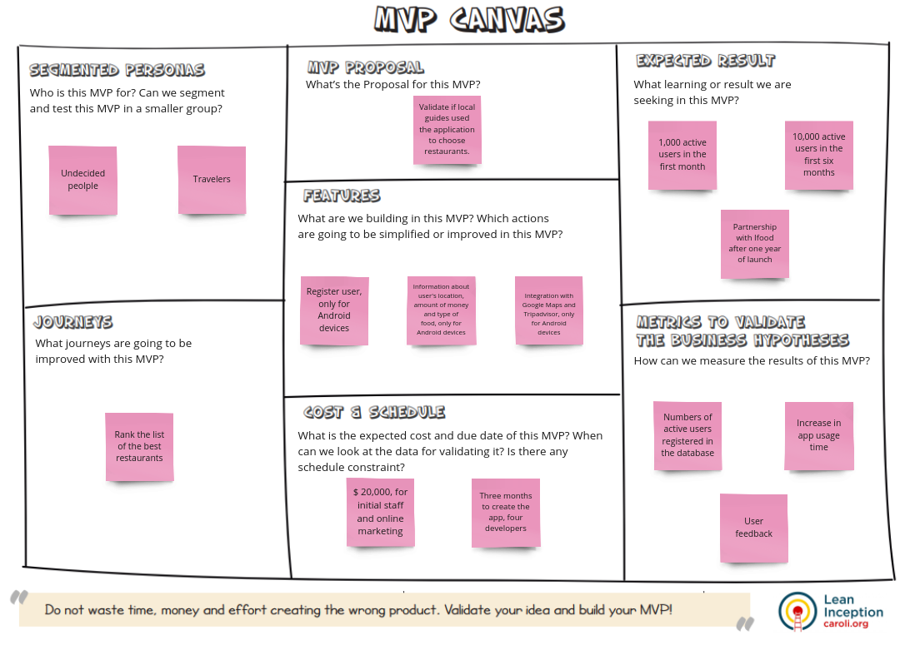
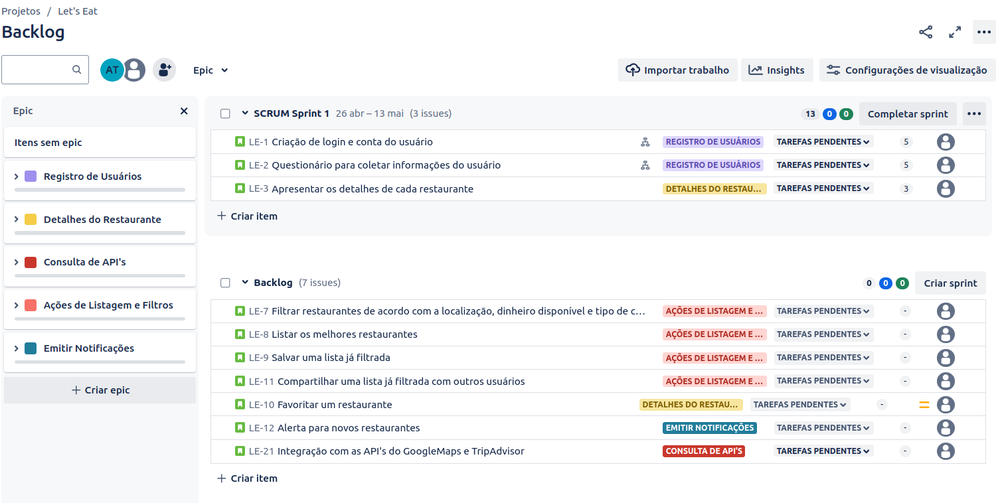
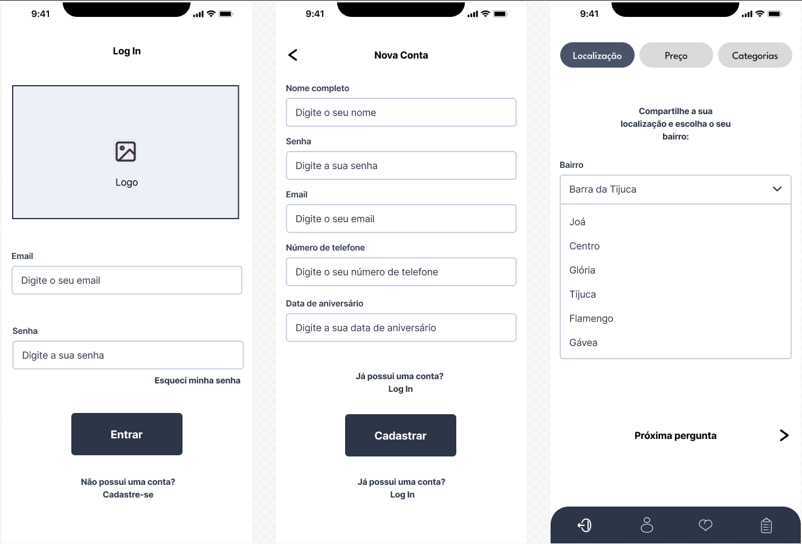
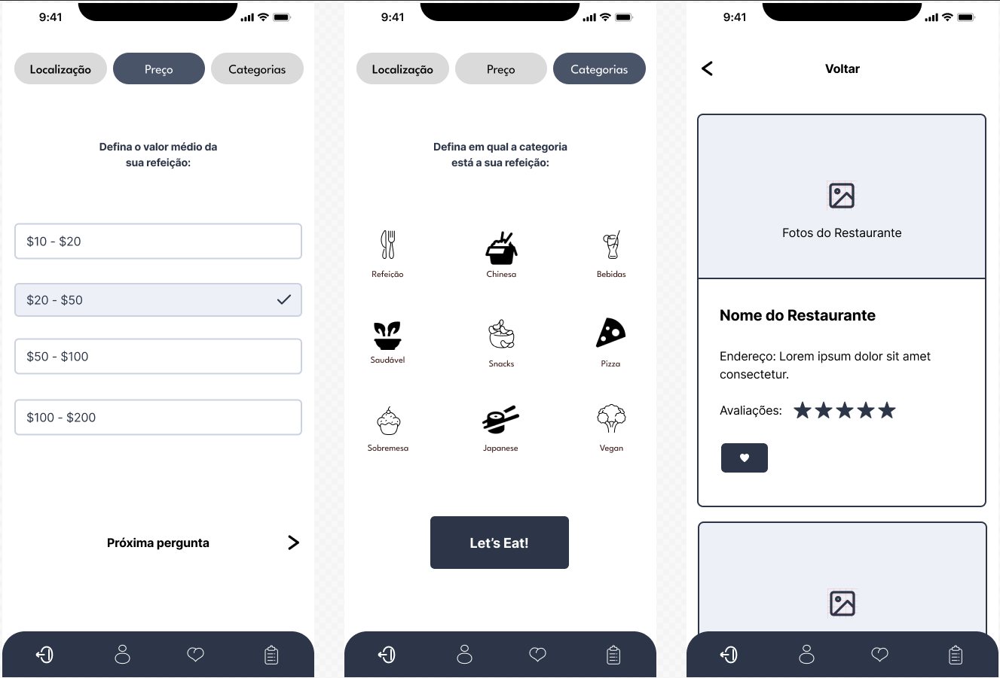
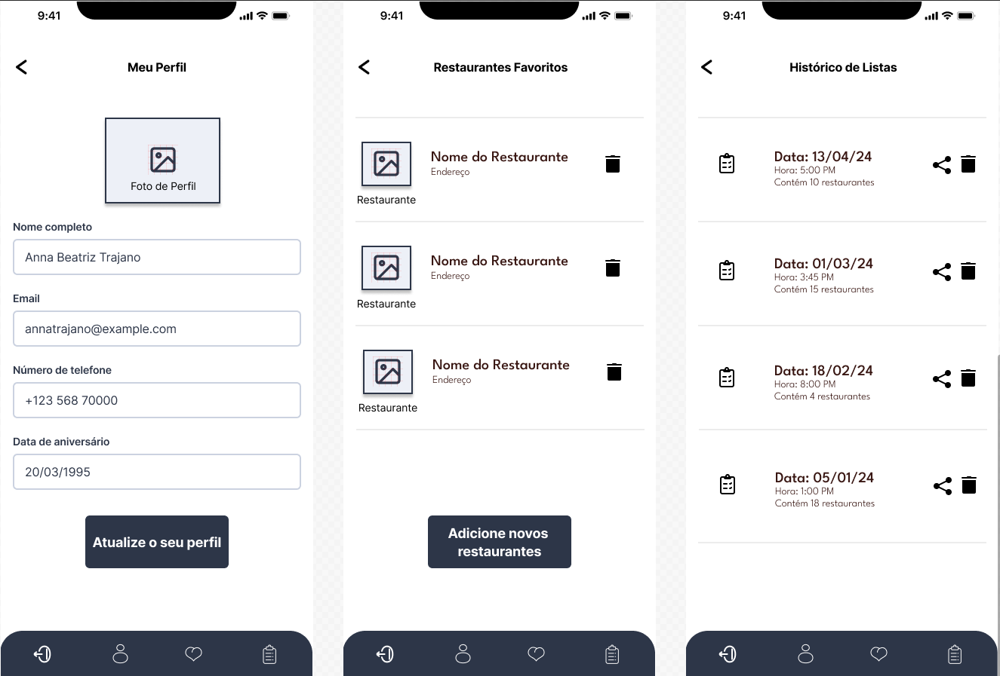

Este projeto contém os requisitos realizados por _[Anna Beatriz Garcia Trajano de Sá](www.linkedin.com/in/anna-beatriz-trajano-de-sá)_ enquanto cursava o curso de Pós-Graduação da PUC-RIO em Engenharia de Software. Ele engloba as disciplinas estudadas na terceira sprint, sendo elas: Gestão Ágil de Projetos, Engenharia de Requisitos e Gestão Ágil de Produtos e 
Design e Prototipação da Interface do Usuário.

# Let's Eat App

Neste projeto, executei e registrei todas as etapas de uma Lean Inception para delinear o MVP da aplicação Let's Eat.

A partir da ideação realizada, com features contidas no MVP Canvas, construí um backlog inicial para o produto, usando a ferramenta Jira. Itens de backlog no formato de épicos, features e histórias de usuário também foram definidos.

Por fim, usando o conhecimento adquirido sobre Design e Prototipação da Interface do Usuário, incluí um protótipo de baixa fidelidade (wireframe) desenvolvido no Figma para a entrega da primeira sprint da aplicação.

Veja a seguir o MVP Canvas, o Backlog do produto e os wirefrimes do projeto!

## MVP Canvas - Lean Inception

MVP           
:-------------------------:|
  |

## Backlog - Jira

Backlog          
:-------------------------:|
  |

## Wireframes - Figma

Pages 1, 2, 3 - Login, New Account and Location            
:-------------------------:|
  |

Pages 4, 5, 6 - Price, Categories and List              
:-------------------------:|
  |

Pages 7, 8, 9 - Profile, Favorite Restaurant and History            
:-------------------------:|
  |
